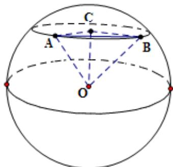
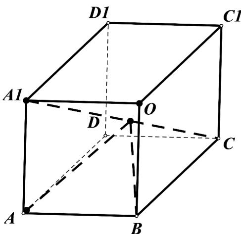

> [!faq]- 《专题12 基本立体图-球、简单几何体（高效培优期中专项训练）数学人教A版高一必修第二册》官方解析
>
> > [!success]- **【答案】** $\frac{\pi}{3} R$
>
> > [!note]- **【解析】**
> > 作图如下:
> >
> > 
> >
> > 设在北纬 $45^{\circ}$ 的纬圆的圆心为 $\mathrm{C}$ ,
> >
> > 球心为 O,
> >
> > 连接 OA、CB、CC、AC、BC,
> >
> > 则 $OC \perp$ 平面 ABC，
> >
> > 在 $Rt\Delta ACO$ 中，
> >
> > $$
> > A C = O A \cos 4 5 ^ {\circ} = \frac {\sqrt {2}}{2} R,
> > $$
> >
> > 同理 $BC = \frac{\sqrt{2}}{2} R$
> >
> > 因为 A、B 两地纬度差为 $90^{\circ}$ ，
> >
> > 所以 $\angle ACB = 90^{\circ}$
> >
> > 在 $Rt\Delta ABC$ 中，
> >
> > $AB = \sqrt{AC^2 + BC^2} = R$
> >
> > 由此可得，
> >
> > $\Delta AOB$ 是边长为 R 的等边三角形，
> >
> > 所以 $\angle AOB = 60^{\circ}$ ,
> >
> > 所以 A、B 两地的球面距离为 $\frac{\pi}{3}R$
> >
> > 故答案为: $\frac{\pi}{3}R$
> >
> > 10．长方体 $ABCD - A_{1}B_{1}C_{1}D_{1}$ 的八个顶点均在同一个球面上， $AB = 2, BC = AA_{1} = \sqrt{2}$ ，则 A, B 两点间的球面距离为 \_\_\_\_．
> >
> > 【答案】 $\frac{\sqrt{2}\pi}{2}$
> >
> > 【详解】如图所示：
> >
> > $$
> > R = \frac {\sqrt {A B ^ {2} + A D ^ {2} + A A _ {1} ^ {2}}}{2} = \frac {\sqrt {8}}{2} = \sqrt {2}
> > $$
> >
> > 设球心为 O，在 $\Delta ABO$ 中： $OA = OB = \sqrt{2}, AB = 2$ 则 $AB^{2} = OA^{2} + OB^{2} \therefore \angle AOB = \frac{\pi}{2}$
> >
> > 球面距离为： $\frac{\pi}{2}R=\frac{\sqrt{2}\pi}{2}$
> >
> > 故答案为 $\frac{\sqrt{2}\pi}{2}$
> >
> > 
