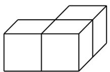
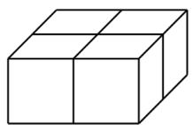
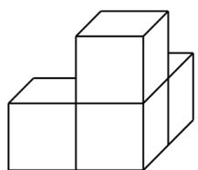
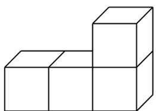
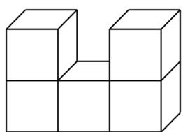
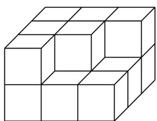

<!-- question-source:start -->
22. 如图，模块①～⑤均由若干个棱长为 $^{1}$ 的小正方体构成，模块⑥由 $^{15}$ 个棱长为 $^{1}$ 的小正方体构成

模块①

模块②

模块③

模块④

模块⑤

模块⑥

(1) 若从模块⑥中拿掉一个小正方体，再从模块①～⑤中选出一个模块放到模块⑥上，使得模块⑥成为一个长方体，则①～⑤中选出的模块可以是\_\_\_\_（答案不唯一）.

(2) 若从模块①～⑤中选出三个放到模块⑥上，使模块⑥成为棱长为 $^{3}$ 的大正方体，则选出的三个模块是\_\_\_\_（答案不唯一）.
<!-- question-source:end -->

![[高中/课堂同步/题库/人教A版高中数学同步讲义(2026)/02_必修第二册/期中专项训练+期中模拟卷/专题12 基本立体图-球、简单几何体（高效培优期中专项训练）数学人教A版高一必修第二册/考点_03_直线与球_平面与球的位置关系/questions/answers/Q00077180A1.md]]
