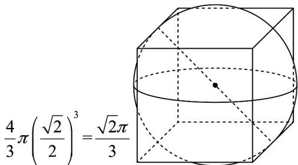

> [!faq]- 《专题12 基本立体图-球、简单几何体（高效培优期中专项训练）数学人教A版高一必修第二册》官方解析
>
> > [!success]- **【答案】** A. 弦 $AB$ ， $CD$ 可能相交于点 $M$ B. 弦 $AB$ ， $CD$ 可能相交于点 $N$ C. $MN$ 的最大值为 5 D. $MN$ 的最小值为 1
>
> > [!note]- **【解析】**
> > ：球的半径为 $^{4}$ ，两条弦AB，CD的长度分别为 $2\sqrt{7}$ ， $4\sqrt{3}$
> >
> > 球心到弦 $AB$ 的距离为 $\sqrt{4^2 - (\sqrt{7})^2} = 3$
> >
> > 球心到弦 CD 的距离为 $\sqrt{4^{2}-(2\sqrt{3})^{2}}=2$
> >
> > 当 $M, O, N$ 三点共线，
> >
> > 且 $M, N$ 分别在 $O$ 两侧时， $MN$ 最大，且最大值为 $5$ ，在球心的同侧时， $MN$ 的最小值为 $3 - 2 = 1$
> >
> > 因为 $3>2$ ，所以 AB，CD 可交于 AB 的中点 M，不可交于 CD 的中点 N；
> >
> > 故选：ACD.
> >
> > 15. 如果一个球和立方体的每条棱都相切，那么称这个球为立方体的棱切球，那么单位立方体的棱切球的体积是\_\_\_\_。
> >
> > 【答案】 $\frac{\sqrt{2}\pi}{3}$
> >
> > 【详解】球和立方体的每条棱都相切，则球的直径为立方体的面对角线长度，
> >
> > 所以单位立方体的棱切球的半径为 $\frac{\sqrt{2}}{2}$
> >
> > 所以球的体积为
> >
> > 
