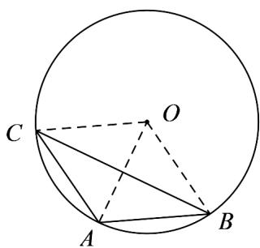

> [!faq]- 《专题12 基本立体图-球、简单几何体（高效培优期中专项训练）数学人教A版高一必修第二册》官方解析
>
> > [!success]- **【答案】** A. 1 B. $\sqrt{2}$ C. $\sqrt{3}$ D. 2
>
> > [!note]- **【解析】**
> > 设球心为 O，连接 OA, OB, OC，由 OA = OB = OC = AB = AC = 1，
> > 所以 $\triangle AOC$ 和 VAOB 均为等边三角形，
> > 所以 DCAO = DBAO = 60°，
> > 所以 $\angle BAC \leq \angle OAC + \angle OAB = 120^{\circ}$ ，当且仅当 O, A, B, C 共面时取等号，如图所示，
> > 此时 BC 取得最大值，
> > 在 VABC 中，由余弦定理得 $BC^{2}=AC^{2}+AB^{2}-2AC\cdot AB\cos\angle BAC$ $=1+1-2\times1\times1\times\left(-\frac{1}{2}\right)=3$ 所以 $BC = \sqrt{3}$ 所以 BC 的最大值为 $\sqrt{3}$
> >
> > 故选：C
> >
> > 
