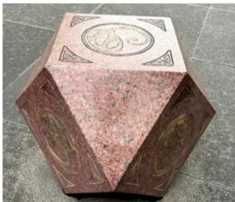
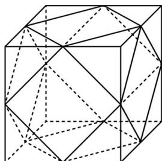

> [!faq]- 《专题12 基本立体图-球、简单几何体（高效培优期中专项训练）数学人教A版高一必修第二册》官方解析
>
> > [!success]- **【答案】**   A. 该几何体的面是等边三角形或正方形 B. 该几何体恰有 $12$ 个面 C. 该几何体恰有 $24$ 条棱 D. 该几何体恰有 $12$ 个顶点
>
> > [!note]- **【解析】**
> > 据图可得该几何体的面是等边三角形或正方形， $^{A}$ 正确；该几何体恰有 $^{14}$ 个面， $^{B}$ 不正确；该几何体恰有 $^{24}$ 条棱， $^{C}$ 正确；该几何体恰有 $^{12}$ 个顶点， $^{D}$ 正确。
> >
> > 故选 **B**
