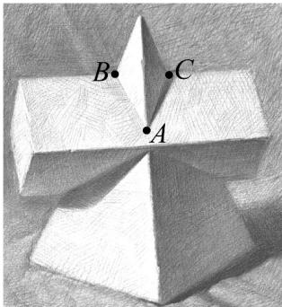

<!-- question-source:start -->
32. 如图，这是某同学绘制的素描作品，图中的几何体由一个正四棱锥和一个正四棱柱贯穿构成，正四棱柱的侧棱平行于正四棱锥的底面，正四棱锥的侧棱长为 $3\sqrt{10}$ ，底面边长为 $6$ ，正四棱柱的底面边长为 $2\sqrt{2} A, B, C$ 是正四棱锥的侧棱和正四棱柱的侧棱的交点，则 $BC = (\quad)$

A. $\sqrt{2}$ B. $\sqrt{3}$ C. 2 D. $\sqrt{5}$
<!-- question-source:end -->

![[高中/课堂同步/题库/人教A版高中数学同步讲义(2026)/02_必修第二册/期中专项训练+期中模拟卷/专题12 基本立体图-球、简单几何体（高效培优期中专项训练）数学人教A版高一必修第二册/考点_05_组合体表面两点间的最短路径/questions/answers/Q00077188A1.md]]
