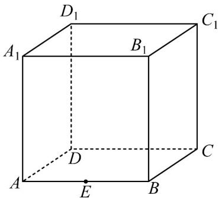

<!-- question-source:start -->
41. 已知正四棱柱 $ABCD - A_1B_1C_1D_1$ 的底面边长 $AB = 6$ ，侧棱长 $AA_1 = 2\sqrt{7}$ ，它的外接球的球心为 $O$ ，点 $E$ 是 $AB$ 的中点，点 $P$ 是球 $O$ 上的任意一点，有以下命题：

① PE 的长的最大值为 9;

②三棱锥 P-EBC 的体积的最大值是 $\frac{32}{3}$ ;

③存在过点 E 的平面，截球 O 的截面面积为 $9\pi$ ;

④三棱锥 $P - AEC_{1}$ 的体积的最大值为20；

其中是真命题的序号是\_\_\_\_
<!-- question-source:end -->

![[高中/课堂同步/题库/人教A版高中数学同步讲义(2026)/02_必修第二册/期中专项训练+期中模拟卷/专题12 基本立体图-球、简单几何体（高效培优期中专项训练）数学人教A版高一必修第二册/考点_05_组合体表面两点间的最短路径/questions/answers/Q00077195A1.md]]
