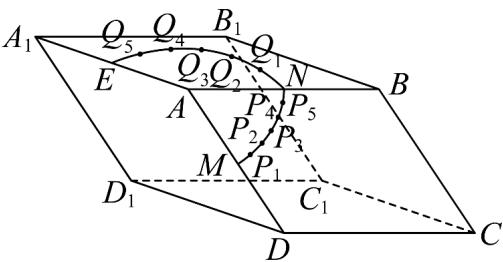
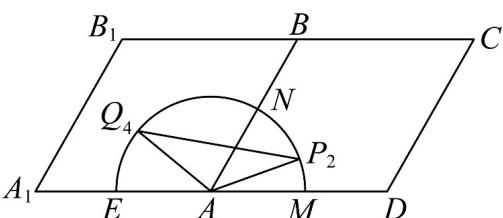

> [!faq]- 《专题12 基本立体图-球、简单几何体（高效培优期中专项训练）数学人教A版高一必修第二册》官方解析
>
> > [!success]- **【答案】**  A. $\frac{4\pi}{3}$ B. $2\sqrt{3}$ C. 2 D. $\sqrt{6} -\sqrt{2}$
>
> > [!note]- **【解析】**
> > 如图，将四边形 $ABB_{1}A_{1}$ 和四边形ABCD沿AB展开，使得两四边形在同一平面，
> >
> > 
> >
> > 连接 $P_{2}Q_{4}$ ，则线段 $P_{2}Q_{4}$ 的长度即为蚂蚁爬行的最短距离，
> >
> > 因为 $P_{2}$ ， $Q_{4}$ 分别为弧MN,NE的六等分点，且 $\angle DAB = \frac{\pi}{3}$ ， $\angle BAA_{1} = \frac{2\pi}{3}$ 所以 $\angle BAP_{2} = \frac{2\pi}{9}$ ， $\angle BAQ_{4} = \frac{4\pi}{9}$ 所以 $\angle P_2AQ_4 = \frac{2\pi}{3}$
> >
> > 又因为 $AP_{2} = 2$ ，所以 $P_{2}Q_{4} = 2\times 2\times \cos \frac{\pi}{3} = 2\sqrt{3}$
> >
> > 故选 **B**
