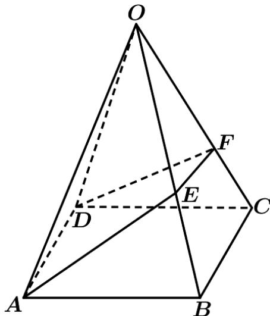
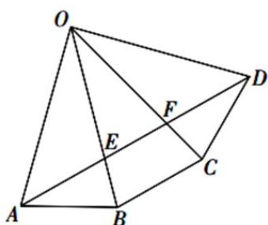

> [!faq]- 《专题12 基本立体图-球、简单几何体（高效培优期中专项训练）数学人教A版高一必修第二册》官方解析
>
> > [!success]- **【答案】** 
>
> > [!note]- **【解析】**
> > 如图，将正四棱锥的侧面展开，则 $AE + EF + FD$ 的最小值为 AD；在 $\triangle OAD$ 中， $OA = OD = 4, \angle AOD = 90^{\circ}$ ，则 $AD = \sqrt{2}OA = 4\sqrt{2}$ 。
> >
> > 
> >
> > 所以 $AE + EF + FD$ 的最小值为 $4\sqrt{2}$ .
> >
> > 故答案为： $4\sqrt{2}$
