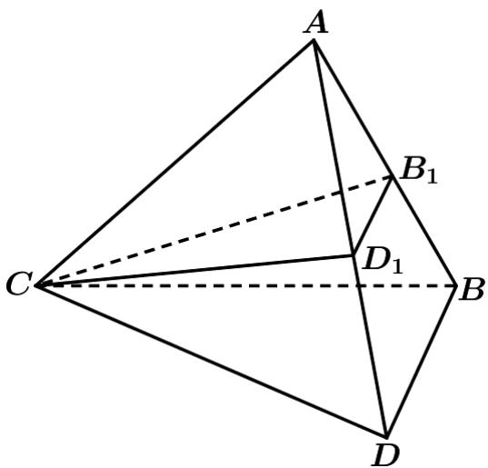
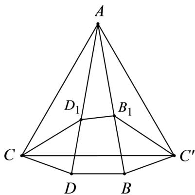

> [!faq]- 《专题12 基本立体图-球、简单几何体（高效培优期中专项训练）数学人教A版高一必修第二册》官方解析
>
> > [!success]- **【答案】**  A. $2\sqrt{2}$ B. $2\sqrt{3}$ C. 4 D. 2
>
> > [!note]- **【解析】**
> > 将正三棱锥 A-BCD 沿 AC 剪开可得如下图形，
> >
> > 
> >
> > $\because \angle BAD = 20^{\circ}$ ，即 $\angle CAC' = \frac{\pi}{3}$ ，又 $\triangle CB_1D_1$ 的周长为 $CD_{1} + D_{1}B_{1} + B_{1}C'$
> >
> > $\therefore$ 要使 $\triangle CB_{1}D_{1}$ 的周长最小，则 $C,D_{1},B_{1},C'$ 共线，即 $CD_{1}+D_{1}B_{1}+B_{1}C'=CC'$
> >
> > 又正三棱锥 A-BCD 侧棱长为 2， $\triangle CAC'$ 是等边三角形，
> >
> > $\therefore (CD_{1} + D_{1}B_{1} + B_{1}C^{\prime})_{\min} = 2.$
> >
> > 故选 **D**
