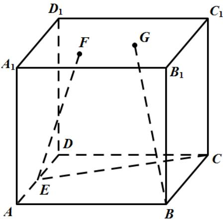
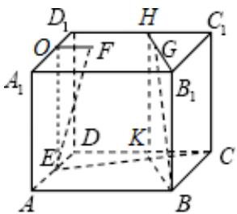
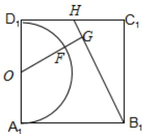

> [!faq]- 《专题12 基本立体图-球、简单几何体（高效培优期中专项训练）数学人教A版高一必修第二册》官方解析
>
> > [!success]- **【答案】** 
>
> > [!note]- **【解析】**
> > 如图，取 $A_{1}D_{1}$ 的中点 $O$ ，连接 $EO$ ， $FO$
> >
> > 则 $EO \perp$ 平面 $A_{1}B_{1}C_{1}D_{1}$ ，连接 $OE$ ，由 $\left|EF\right| = \sqrt{5}$ ， $OE = 2$ ，
> >
> > 可得 $OF = 1$ ，则 $F$ 在以 $O$ 为圆心，以 $1$ 为半径的圆上，
> >
> > 取 $CD$ 中点 $K$ , 连接 $BK$ , 在正方形 $ABCD$ 中,
> >
> > 由 $E$ 为 $AD$ 的中点， $K$ 为 $CD$ 的中点，
> >
> > 可得 $CE \perp BK$ ，取 $C_{1}D_{1}$ 的中点 H，连接 KH， $B_{1}H$ ，
> >
> > 由 $BB_{1}\parallel KH$ ， $BB_{1} = KH$ ，得四边形 $BB_{1}HK$ 为平行四边形，则 $BK\parallel B_1H$ ，得 $G$ 在线段 $B_{1}H$ 上.
> >
> > 过 $O$ 作 $OG \perp B_{1}H$ ，交半圆弧于 $F$ ，则 $|FG|$ 为要求的最小值。
> >
> > 由已知可得 $B_{1}H = \sqrt{5}$ ，设 $|OG| = h$ ，
> >
> > 由等面积法可得， $\frac{1}{2}\times\sqrt{5}\times h=2\times2-\frac{1}{2}\times2\times1-\frac{1}{2}\times1\times1-\frac{1}{2}\times2\times1=\frac{3}{2}$
> >
> > 可得 $h = \frac{3\sqrt{5}}{5}$ ，∴ $|FG|$ 的最小值为 $\frac{3\sqrt{5}}{5} -1$
> >
> > 故答案为: $\frac{3\sqrt{5}}{5} - 1$
> >
> > 
> >
> > 
