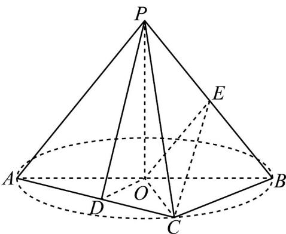
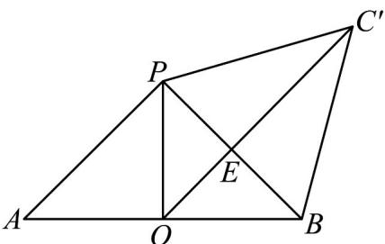

> [!faq]- 《专题12 基本立体图-球、简单几何体（高效培优期中专项训练）数学人教A版高一必修第二册》官方解析
>
> > [!success]- **【答案】** 
>
> > [!note]- **【解析】**
> > 在 $\triangle POB$ 中， $PO = OB = \sqrt{2}$ ， $\angle POB = 90^{\circ}$
> >
> > 所以 $PB = \sqrt{(\sqrt{2})^{2} + (\sqrt{2})^{2}} = 2$
> >
> > 同理 PC = 2，所以 PB = PC = BC，
> >
> > 在三棱锥 $P^{-}ABC$ 中，将侧面 $BCP$ 绕 $PB$ 旋转至平面 $BC^{\prime}P$ ，使之与平面 $ABP$ 共面，如图所示，当 $O,E,C'$ 共线时， $CE^{+}OE$ 取得最小值，
> >
> > 又因为 OP = OB， $C'P = C'B$ ，
> >
> > 所以 $OC'$ 垂直平分 PB，即 E 为 PB 中点。
> >
> > 从而 $OC' = OE^{+}EC' = \frac{\sqrt{2}}{2} + \frac{\sqrt{6}}{2} = \frac{\sqrt{2} + \sqrt{6}}{2}$
> >
> > 亦即 $CE^{+}OE$ 的最小值为： $\frac{\sqrt{2} + \sqrt{6}}{2}$
> >
> > 故答案为： $\frac{\sqrt{2}+\sqrt{6}}{2}$
> >
> > 
