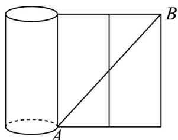
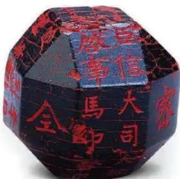
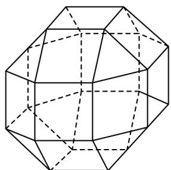
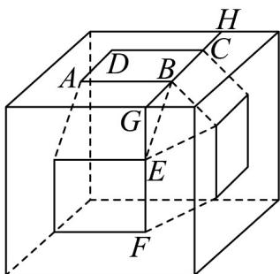

> [!faq]- 《专题12 基本立体图-球、简单几何体（高效培优期中专项训练）数学人教A版高一必修第二册》官方解析
>
> > [!success]- **【答案】** $5\pi$
>
> > [!note]- **【解析】**
> > 如图，把圆柱的侧面展开图再延展一倍，
> >
> > 
> >
> > 所以铁丝的最短长度即为 $AB$ 的长，又 $AB = \sqrt{9\pi^2 + (4\pi)^2} = 5\pi$ ，填 $5\pi$
> >
> > 考点06组合体截面的形状
> >
> > 31. 中国有悠久的金石文化，印信是金石文化的代表之一．印信的形状多为长方体、正方体或圆柱体，但南北朝时期的官员独孤信的印信形状是“半正多面体”（图 $^{1}$ ）．半正多面体是由两种或两种以上的正多边形围成的多面体·半正多面体体现了数学的对称美．图 $^{2}$ 是一个棱数为 $^{48}$ 的半正多面体，它的所有顶点都在同一个正方体的表面上，且此正方体的棱长为 $^{1}$ ．则该半正多面体的棱长为（）
> >
> > 【答案】
> >
> > 
> > 图1
> >
> > 
> > 图2
> >
> > A. $2 - \sqrt{2}$ B. $\sqrt{2} -1$ C. $\frac{\sqrt{2}}{4}$ D. $\frac{1}{3}$
> >
> > 【答案】B
> >
> > 【详解】如图，设该半正多面体的棱长为 $x$ ，则 $AB = BE = x$ 延长 $CB$ 与 $FE$ 交于点 $G$ ，延长 $BC$ 交正方体棱于 $H$ ，由半正多面体对称性可知， $\triangle BGE$ 为等腰直角三角形， $\therefore BG = GE = CH = \frac{\sqrt{2}}{2} x$ ， $\therefore GH = 2 \times \frac{\sqrt{2}}{2} x + x = (\sqrt{2} + 1)x = 1$ $\therefore x = \frac{1}{\sqrt{2} + 1} = \sqrt{2} - 1$ ，即该半正多面体棱长为 $\sqrt{2} - 1$
> >
> > 
> >
> > 故选 **B**
