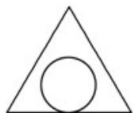
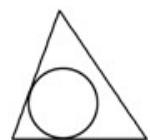
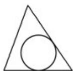
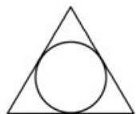
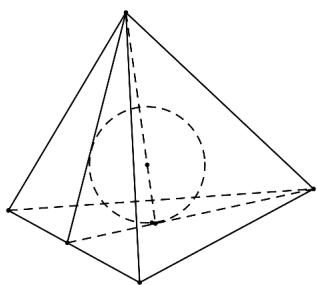
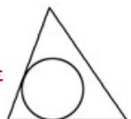

> [!faq]- 《专题12 基本立体图-球、简单几何体（高效培优期中专项训练）数学人教A版高一必修第二册》官方解析
>
> > [!success]- **【答案】** A  B  C  D 
>
> > [!note]- **【解析】**
> > 如图所示：
> >
> > 
> >
> > 因为三棱锥的各棱长均相等，所以该三棱锥为正四面体，内切球与各面相切于各个面的中心，
> >
> > 即可知过一条侧棱和对边的中点作三棱锥的截面，所得截面图形是
> >
> > 故选：B.
> >
> > 
