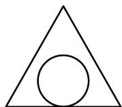
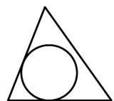
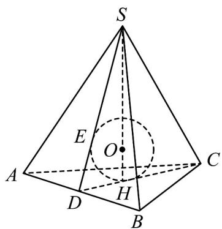

> [!faq]- 《专题12 基本立体图-球、简单几何体（高效培优期中专项训练）数学人教A版高一必修第二册》官方解析
>
> > [!success]- **【答案】** A   B
>
> > [!note]- **【解析】**
> > 如图所示，设三棱锥 S-ABC 的各棱长均相等，球 O 是它的内切球，
> >
> > 设 $H$ 为底面 $\Delta ABC$ 的中心，根据对称性可得内切球的球心 $O$ 在三棱锥的高 $SH$ 上，
> >
> > 由 SC, SH 确定的平面交 AB 于 D，连接 AD, CD，得到截面 $\Delta SCD$
> >
> > 截面 SCD 就是经过侧棱 SC 与 AB 中点的截面，
> >
> > 平面 $SCD$ 与内切球相交，截得的球大圆如图所示，
> >
> > 因为 $\Delta SCD$ 中，圆 O 分别与 AD, CE 相切于点 E, H ，且 SD = CD ，圆 O 与 SC 相离，
> >
> > 所对照各个选项，可得只有 $^{B}$ 项的截面符合题意，故选 $^{B}$ .
> >
> > 
