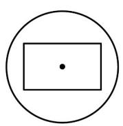
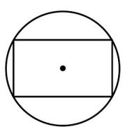
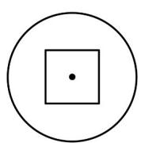

> [!faq]- 《专题12 基本立体图-球、简单几何体（高效培优期中专项训练）数学人教A版高一必修第二册》官方解析
>
> > [!success]- **【答案】**  (1)  (2)  (3)
>
> > [!note]- **【解析】**
> > 当截面平行于正方体的一个侧面时得 $^{3}$ ；
> >
> > 当截面过正方体的体对角线时得 $(2)$ ;
> >
> > 当截面既不平行于任何侧面也不过体对角线时得（1）；
> >
> > 但无论如何都不能截出 $^{4}$
> >
> > 答案： $(1)(2)(3)$
