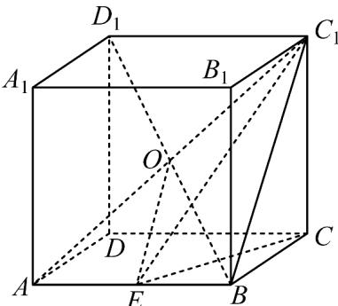

> [!faq]- 《专题12 基本立体图-球、简单几何体（高效培优期中专项训练）数学人教A版高一必修第二册》官方解析
>
> > [!success]- **【答案】** ①③④
>
> > [!note]- **【解析】**
> > 外接球半径为： $R=\frac{\sqrt{36+36+28}}{2}=5$ ， $EO=\frac{\sqrt{36+28}}{2}=4$ ，
> >
> > 故 $PE$ 的最大值为 $EO + R = 9$ ，①正确；
> >
> > $S_{\triangle EBC}=\frac{1}{2}\times3\times6=9$ ，高 $h_{max}=\frac{AA_{1}}{2}+R=\sqrt{7}+5$ ，故 $V_{max}=\frac{1}{3}\times9\times(\sqrt{7}+5)=3\sqrt{7}+15$ ，②错误；
> >
> > 当截面与 EO 垂直时， $r = \sqrt{R^{2} - EO^{2}} = 3$ ，故 $S = 9\pi$ ，故③正确；
> >
> > $S_{\triangle AEC_{1}}=\frac{1}{2}\times3\times\sqrt{36+28}=12$ ， $h_{max}=R=5$ ，故 $V_{max}=20$ ，故④正确；
> >
> > 
> >
> > 故答案为：①③④·
