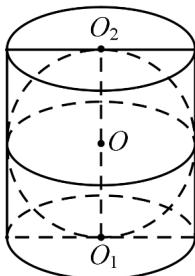

> [!faq]- 《专题12 基本立体图-球、简单几何体（高效培优期中专项训练）数学人教A版高一必修第二册》官方解析
>
> > [!success]- **【答案】**  A. $4\pi$ B. $5\pi$ C. $6\pi$ D. $\pi$
>
> > [!note]- **【解析】**
> > 因为该球与圆柱的上下底面，母线均相切，不妨设圆柱底面半径为 r ，故 $2r = O_{1}O_{2} = 2$ ，解得 r = 1 ，
> >
> > 故该圆柱的表面积为 $2\pi r^{2} + 2\pi rO_{1}O_{2} = 2\pi +4\pi = 6\pi$
> >
> > 故选 **C**.
