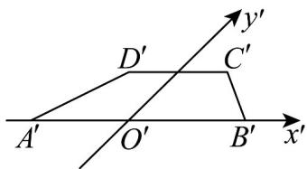

<!-- question-source:start -->
5. 如图，这是用斜二测画法画出的水平放置的梯形 $ABCD$ 的直观图，其中 $A'B' // C'D'$ ， $A'B' = 2C'D' = 8$

梯形 $A^{\prime}B^{\prime}C^{\prime}D^{\prime}$ 的面积为 30，则梯形 ABCD 的高为 \_\_\_\_.

<!-- question-source:end -->

![[高中/课堂同步/题库/人教A版高中数学同步讲义(2026)/02_必修第二册/期中专项训练+期中模拟卷/专题13 立体图形的直观图（高效培优期中专项训练）数学人教A版高一必修第二册/专题13_立体图形的直观图/questions/answers/Q00077201A1.md]]
