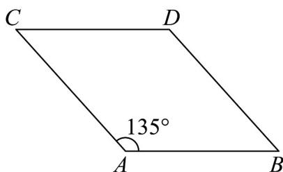
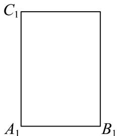

> [!faq]- 《专题13 立体图形的直观图（高效培优期中专项训练）数学人教A版高一必修第二册》官方解析
>
> > [!success]- **【答案】**  A. $3\sqrt{2}$ B. $6\sqrt{2}$ C. $3\sqrt{3}$ D. $2\sqrt{6}$
>
> > [!note]- **【解析】**
> > 因为 $AB \cdot AC = -3$ ，所以 $\left|AB\right| \cdot \left|AC\right| \cos 135^\circ = -3$
> >
> > 可得 $\left|AB\right|\cdot\left|AC\right|=3\sqrt{2}$
> >
> > 原图形是长为 $\left|AB\right|$ ，宽为 $\left|AC\right|$ 的2倍的长方形，即 $\left|A_{1}B_{1}\right|=\left|AB\right|$ ， $\left|A_{1}C_{1}\right|=2\left|AC\right|$ ，
> > 所以原图形的面积为 $2\left|\begin{matrix}AB\\ \end{matrix}\right|\cdot\left|\begin{matrix}ABC\\ \end{matrix}\right|=6\sqrt{2}$ .
> >
> > 故选：B.
> >
> > 
