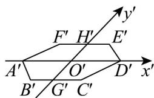
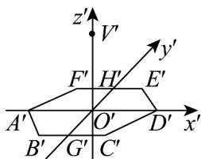
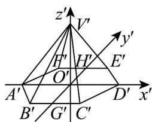
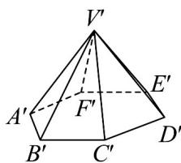

> [!faq]- 《专题13 立体图形的直观图（高效培优期中专项训练）数学人教A版高一必修第二册》官方解析
>
> > [!success]- **【答案】** 直观图见解析
>
> > [!note]- **【解析】**
> > （1）先画出边长为 $3\mathrm{cm}$ 的正六边形的水平放置的直观图，如图①所示.
> >
> > (2) 过正六边形的中心 $O'$ 建立 $z'$ 轴，在 $z'$ 轴上截取 $O'V' = 3\mathrm{cm}$ ，如图②所示。
> >
> > (3) 连接 $V^{\prime}A^{\prime}$ , $V^{\prime}B^{\prime}$ , $V^{\prime}C^{\prime}$ , $V^{\prime}D^{\prime}$ , $V^{\prime}E^{\prime}$ , $V^{\prime}F^{\prime}$ ，如图③所示.
> >
> > (4) 擦去辅助线，遮挡部分用虚线表示，即得到正六棱锥的直观图，如图④所示.
> >
> > 
> > - **①**：
> >
> > 
> > - **③**：
> > - **②**：
> > - **④**：
