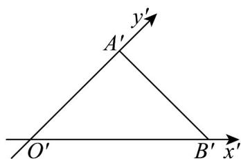
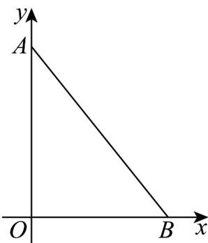

> [!faq]- 《专题13 立体图形的直观图（高效培优期中专项训练）数学人教A版高一必修第二册》官方解析
>
> > [!success]- **【答案】**  A. $8 + 2\sqrt{2}$ B. $8 + 4\sqrt{2}$ C. $4 + 4\sqrt{2} + 4\sqrt{3}$ D. $4 + 2\sqrt{2} + 2\sqrt{6}$
>
> > [!note]- **【解析】**
> > 在直观图中 $O'A' = A'B' = 2$ ， $\angle O'A'B' = 90^{\circ}$ ，所以 $O'B' = \sqrt{2^{2} + 2^{2}} = 2\sqrt{2}$ 如图 $\triangle O'A'B'$ 对应的原图形为 $\triangle OAB$ ，则 $OA = 2O'A' = 4$ ， $OB = O'B' = 2\sqrt{2}$ ，
> > 所以 $AB = \sqrt{16 + 8} = 2\sqrt{6}$ ，故 $\angle OAB$ 的周长为 $4 + 2\sqrt{2} + 2\sqrt{6}$ ，
> >
> > 
> >
> > 故选：D
> >
> > ## 考点04斜二测画法中相关量的计算
