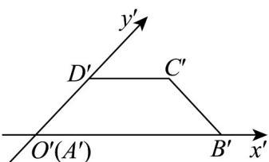

> [!faq]- 《专题13 立体图形的直观图（高效培优期中专项训练）数学人教A版高一必修第二册》官方解析
>
> > [!success]- **【答案】**  A. $A^{\prime}D^{\prime} = 2\sqrt{2}$ B $AB = 3$ C．四边形ABCD的周长为 $10+\sqrt{6}+\sqrt{2}$ D．四边形ABCD的面积为 $10\sqrt{2}$
>
> > [!note]- **【解析】**
> > 由题设 $A^{\prime}D^{\prime}=\sqrt{2}\times\frac{A^{\prime}B^{\prime}-C^{\prime}D^{\prime}}{2}=\sqrt{2}$ ，A 错；
> >
> > 由斜二测画法知， $AB = A'B' = 6$ ， $CD = C'D' = 4$ ， $AD = 2A'D' = 2\sqrt{2}$
> >
> > 易知原四边形 ABCD 为直角梯形， $AD \perp AB$ ， $AB \parallel CD$
> >
> > 所以 $BC = \sqrt{AD^2 + (AB - CD)^2} = \sqrt{8 + 4} = 2\sqrt{3}$
> >
> > 四边形的周长为 $10 + 2\sqrt{3} + 2\sqrt{2}$ ，面积为 $\frac{1}{2} \times 2\sqrt{2} \times (4 + 6) = 10\sqrt{2}$ ，B、C错，D对。
> >
> > 故选 **D**.
