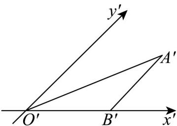
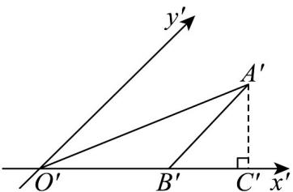

> [!faq]- 《专题13 立体图形的直观图（高效培优期中专项训练）数学人教A版高一必修第二册》官方解析
>
> > [!success]- **【答案】** 
>
> > [!note]- **【解析】**
> > 因为 $A'B' // y'$ 轴，所以 $\triangle ABO$ 的中， $AB \perp OB$
> >
> > 又三角形的面积为 16，所以 $\frac{1}{2}AB \cdot OB = 16 \therefore AB = 8$ ，
> >
> > 所以 $A^{\prime}B^{\prime}=4$
> >
> > 如图作 $A^{\prime}C^{\prime}\perp O^{\prime}B^{\prime}$ 于 $C^{\prime}$ ，
> >
> > 
> >
> > 因为 $\angle A^{\prime}B^{\prime}C^{\prime}=45^{\circ}$ ，所以 $A^{\prime}C^{\prime}=4\sin45^{\circ}=2\sqrt{2}$
> >
> > 所以 $S_{\triangle A'B'C'} = \frac{1}{2} B'O'\cdot A'C' = \frac{1}{2}\times 4\times 2\sqrt{2} = 4\sqrt{2}.$
> >
> > 故答案为： $4\sqrt{2}$
