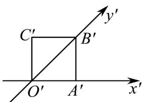
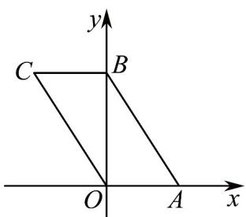

> [!faq]- 《专题13 立体图形的直观图（高效培优期中专项训练）数学人教A版高一必修第二册》官方解析
>
> > [!success]- **【答案】**  A. 8cm B. 6cm C. $2(1 + \sqrt{2})\mathrm{cm}$ D. $2(1 + 2\sqrt{2})\mathrm{cm}$
>
> > [!note]- **【解析】**
> > 由三视图知原图形是平行四边形 $OABC$ ，如图， $OA = O'A' = 1\mathrm{cm}$ ， $OB \perp OA$
> >
> > $$
> > O B = 2 O ^ {\prime} B ^ {\prime} = 2 \sqrt {2} \mathrm{cm}
> > $$
> >
> > $$
> > A B = \sqrt {1 ^ {2} + (2 \sqrt {2}) ^ {2}} = 3 \mathrm{cm}
> > $$
> >
> > 所以平行四边形OABC的周长是 $2\times1+2\times3=8(\text{cm})$ .
> >
> > 故选：A
> >
> > 
