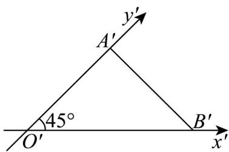
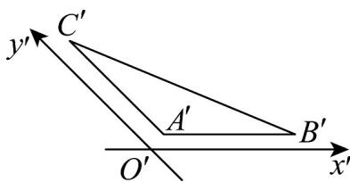
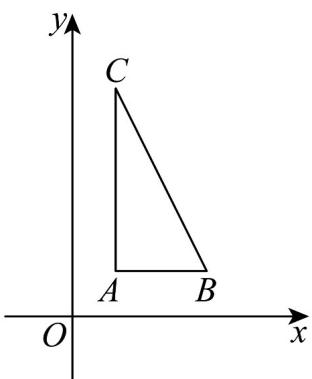

> [!faq]- 《专题13 立体图形的直观图（高效培优期中专项训练）数学人教A版高一必修第二册》官方解析
>
> > [!success]- **【答案】**  A.6 B. $3\sqrt{2}$ C. $6\sqrt{2}$ D.12
>
> > [!note]- **【解析】**
> > 因为 $O'B' = 4$ ， $O'A' = 3$
> >
> > 所以 OB = 4, OA = 6
> >
> > 则 $\triangle OAB$ 的面积是 $S_{\triangle OAB} = \frac{1}{2} OA\times OB = \frac{1}{2}\times 4\times 6 = 12$
> >
> > 故选：D.
> >
> > 23. VABC 的直观图 $\triangle A'B'C'$ 如图所示，其中 $A'B' \parallel x'$ 轴， $A'C' \parallel y'$ 轴，且 $\left|A'B'\right| = \left|A'C'\right| = 2$ ，则 VABC 的面积为 \_\_\_\_。
> >
> > 【答案】
> >
> > 
> >
> > 【答案】4
> >
> > 【详解】将直观图还原为原图，如图所示，
> >
> > 
> >
> > 则VABC是直角三角形，其中 $AC = 4,AB = 2$
> >
> > 故VABC的面积为 $S_{\triangle ABC} = \frac{1}{2} \times 4 \times 2 = 4$
> >
> > 故答案为：4.
