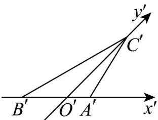

> [!faq]- 《专题13 立体图形的直观图（高效培优期中专项训练）数学人教A版高一必修第二册》官方解析
>
> > [!success]- **【答案】**  A. $\sqrt{2}$ B. $\sqrt{3}$ C. $\sqrt{6}$ D. $2\sqrt{6} - 2\sqrt{2}$
>
> > [!note]- **【解析】**
> > 已知在 $\triangle A'B'C'$ 中， $a'^2 - c'^2 = b'c' + b'^2$ ，移项可得 $a'^2 = b'^2 + c'^2 + b'c'$ .
> >
> > 根据余弦定理 $\cos A' = \frac{b'^2 + c'^2 - a'^2}{2b'c'}$ ，将 $a'^2 = b'^2 + c'^2 + b'c'$ 代入可得： $\cos A' = \frac{b'^2 + c'^2 - (b'^2 + c'^2 + b'c')}{2b'c'} = \frac{-b'c'}{2b'c'} = -\frac{1}{2}$ .
> >
> > 因为 $0^\circ < A' < 180^\circ$ ，所以 $A' = 120^\circ$ .
> >
> > 已知 $b' = 1$ ，即 $A'C' = 1$ ，那么 $\triangle A'B'C'$ 中 $A'B'$ 边上的高 $h' = A'C'\sin 60^\circ = 1 \times \frac{\sqrt{3}}{2} = \frac{\sqrt{3}}{2}$ .
> >
> > 根据斜二测画法的性质，在斜二测画法中，平行于 $y$ 轴的线段长度变为原来的一半，
> >
> > 那么原三角形 VABC 中 AB 边上的高 $h = OC = 2O'C' = 2\sqrt{2}h'$ .
> >
> > 将 $h' = \frac{\sqrt{3}}{2}$ 代入可得 $h = 2\sqrt{2} \times \frac{\sqrt{3}}{2} = \sqrt{6}$ .
> >
> > 所以 VABC 中 AB 边上的高为 $\sqrt{6}$ .
> >
> > 故选 **C**.
