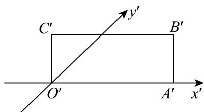

> [!faq]- 《专题13 立体图形的直观图（高效培优期中专项训练）数学人教A版高一必修第二册》官方解析
>
> > [!success]- **【答案】** 
>
> > [!note]- **【解析】**
> > 在直观图中， $O'A'=6, O'C'=2$
> >
> > ∴直观图面积为： $6 \times 2 = 12$
> >
> > ∵直观图面积：原图形面积= $\frac{\sqrt{2}}{4}$ ，
> >
> > ∴原图形面积= $2\sqrt{2}\times12=24\sqrt{2}$
> >
> > 故答案为： $24\sqrt{2}$
