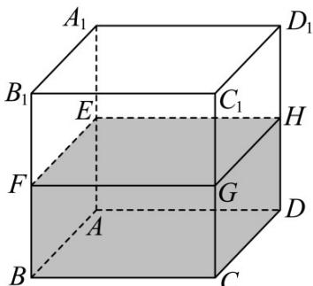
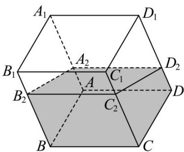

<!-- question-source:start -->
9. 如图 1，内壁光滑且透明的正方体容器 $ABCD - A_{1}B_{1}C_{1}D_{1}$ 内注有一定量的水，已知正方体容器棱长为 4，容器厚度不计·当其水平放置时，水面恰好过 $AA_{1}$ ， $BB_{1}$ ， $CC_{1}$ ， $DD_{1}$ 的中点 $E$ ， $F$ ， $G$ ， $H$ ·现在固定容器一边 $BC$ 于水平地面，再将容器倾斜，随着倾斜角度的不同，水面的形状也不同·容器绕 $BC$ 从图 1 的放置状态旋转至水面第一次过棱 $AD$ 的过程中（不包括起始和终止位置），水面与棱 $AA_{1}$ ， $BB_{1}$ ， $CC_{1}$ ， $DD_{1}$ 分别交于点 $A_{2}$ ， $B_{2}$ ， $C_{2}$ ， $D_{2}$ ·假设旋转过程中水面始终呈水平状态，不考虑水面的波动·

图1

图2

(1)证明： $AA_{2}+BB_{2}$ 是定值；

(2)已知水面 $A_{2}B_{2}C_{2}D_{2}$ 是矩形面，求水面 $A_{2}B_{2}C_{2}D_{2}$ 面积的取值范围.
<!-- question-source:end -->

![[高中/课堂同步/题库/人教A版高中数学同步讲义(2026)/02_必修第二册/期中专项训练+期中模拟卷/专题14 简单几何体的表面积和体积（高效培优期中专项训练）数学人教A版高一必修第二册/专题14_简单几何体的表面积和体积/questions/answers/Q00077230A1.md]]
