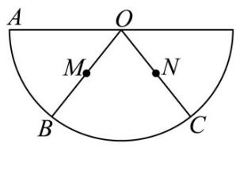
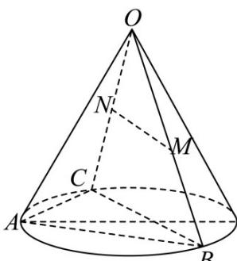

<!-- question-source:start -->
19. 如图 1，设半圆的直径为 4，点 B、C 三等分半圆，点 M、N 分别是 OB、OC 的中点，将此半圆以 OA 为母线卷成一个圆锥（如图 2）。在图 2 中完成下列各题：

图1

图2

(1)求圆锥中线段 $MN$ 的长；

(2)求四面体 $ACMN$ 的体积；

(3)求三棱锥 M-ABC 与三棱锥 N-ABC 公共部分的体积.
<!-- question-source:end -->

![[高中/课堂同步/题库/人教A版高中数学同步讲义(2026)/02_必修第二册/期中专项训练+期中模拟卷/专题14 简单几何体的表面积和体积（高效培优期中专项训练）数学人教A版高一必修第二册/专题14_简单几何体的表面积和体积/questions/answers/Q00077236A1.md]]
