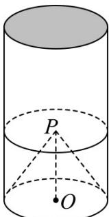

<!-- question-source:start -->
20．如图所示，某建筑物模型无下底面，有上底面，其外观是圆柱，底部挖去一个圆锥·已知圆柱与圆锥的底面大小相同，圆柱的底面半径为 $6\mathrm{cm}$ ，高为 $20\mathrm{cm}$ ，圆锥母线为 $10\mathrm{cm}$ 。

(1)计算该模型的体积·(结果精确到 $1cm^{3}$ )

(2)现需使用油漆对 $400$ 个该种模型进行涂层，油漆费用为每平方米 $30$ 元，总费用是多少？（结果精确到1元）
<!-- question-source:end -->

![[高中/课堂同步/题库/人教A版高中数学同步讲义(2026)/02_必修第二册/期中专项训练+期中模拟卷/专题14 简单几何体的表面积和体积（高效培优期中专项训练）数学人教A版高一必修第二册/专题14_简单几何体的表面积和体积/questions/answers/Q00077237A1.md]]
