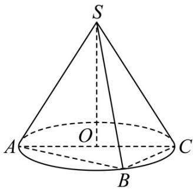

<!-- question-source:start -->
23. 如图， $AC$ 为圆锥 $SO$ 底面圆 $O$ 的直径，点 $B$ 是圆 $O$ 上异于 $A$ ， $C$ 的动点， $SO = OC = 3$ ，则下列结论

正确的是（）

A. 圆锥 $SO$ 的侧面积为 $9\sqrt{2}\pi$

B．三棱锥 S-ABC 体积的最大值为 9

C. $\angle SAB$ 的取值范围是 $\left(\frac{\pi}{4}, \frac{\pi}{3}\right)$

D. 若 $AB = BC$ ， $E$ 为线段 $AB$ 上的动点，则 $SE + CE$ 的最小值为 $3\left(\sqrt{3} + 1\right)$
<!-- question-source:end -->

![[高中/课堂同步/题库/人教A版高中数学同步讲义(2026)/02_必修第二册/期中专项训练+期中模拟卷/专题14 简单几何体的表面积和体积（高效培优期中专项训练）数学人教A版高一必修第二册/专题14_简单几何体的表面积和体积/questions/answers/Q00077239A1.md]]
