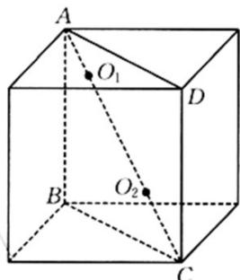

<!-- question-source:start -->
26. 如图，在棱长为 $\sqrt{3}$ 的正方体内，球 $O_{1}$ 与球 $O_{2}$ 的球心 $O_{1}, O_{2}$ 均在线段 $AC$ 上，这两个球外切并且球 $O_{1}$ 与该正方体的上底面相切，球 $O_{2}$ 与该正方体的下底面相切。

(1)求这两个球的半径之和.

(2)当这两个球的半径分别为多少时，这两个球的表面积之和最小？并求出这个最小值。
<!-- question-source:end -->

![[高中/课堂同步/题库/人教A版高中数学同步讲义(2026)/02_必修第二册/期中专项训练+期中模拟卷/专题14 简单几何体的表面积和体积（高效培优期中专项训练）数学人教A版高一必修第二册/专题14_简单几何体的表面积和体积/questions/answers/Q00077241A1.md]]
