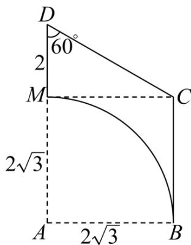

<!-- question-source:start -->
43. 在一个如图所示的直角梯形 $ABCD$ 内挖去一个扇形， $M$ 是梯形的下底边上的一点，将所得平面图形绕直线 $DM$ 旋转一周。

(1)说明所得几何体的结构特征；

(2)求所得几何体的表面积和体积·
<!-- question-source:end -->

![[高中/课堂同步/题库/人教A版高中数学同步讲义(2026)/02_必修第二册/期中专项训练+期中模拟卷/专题14 简单几何体的表面积和体积（高效培优期中专项训练）数学人教A版高一必修第二册/专题14_简单几何体的表面积和体积/questions/answers/Q00077251A1.md]]
