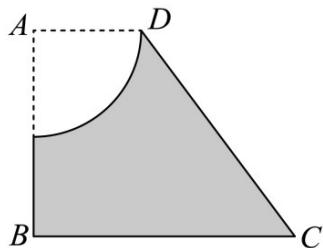

<!-- question-source:start -->
44. 在直角梯形 $ABCD$ 中， $AD//BC$ ， $\angle ABC = 90^\circ$ ，且 $AD = 2$ ， $AB = 4$ ， $BC = 5$ 。在梯形 $ABCD$ 内，挖去一个以 $A$ 为圆心，以 $2$ 为半径的四分之一圆，得到如图所示的阴影部分以 $AB$ 所在直线为轴，将图中阴影

部分旋转一周形成的旋转体的表面积为（）

A. $64\pi$ B. $68\pi$ C. $72\pi$ D. $76\pi$
<!-- question-source:end -->

![[高中/课堂同步/题库/人教A版高中数学同步讲义(2026)/02_必修第二册/期中专项训练+期中模拟卷/专题14 简单几何体的表面积和体积（高效培优期中专项训练）数学人教A版高一必修第二册/专题14_简单几何体的表面积和体积/questions/answers/Q00077252A1.md]]
