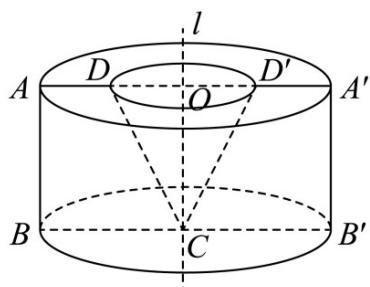

<!-- question-source:start -->
46. 如图，在梯形 $ABCD$ 中， $\angle ABC = 90^{\circ}$ ， $AD \parallel BC$ ，且 $\left|AD\right| = a$ ， $\left|BC\right| = 2a$ ， $\angle DCB = 60^{\circ}$ ，在平面 $ABCD$ 内过点 $C$ 作 $l \perp CB$ ，以 $l$ 为轴将四边形 $ABCD$ 旋转一周。

(1)求旋转体的表面积；

(2)求旋转体的体积；

(3)求图中所示圆锥 $\mathrm{CO}$ 的内切球体积.
<!-- question-source:end -->

![[高中/课堂同步/题库/人教A版高中数学同步讲义(2026)/02_必修第二册/期中专项训练+期中模拟卷/专题14 简单几何体的表面积和体积（高效培优期中专项训练）数学人教A版高一必修第二册/专题14_简单几何体的表面积和体积/questions/answers/Q00077254A1.md]]
