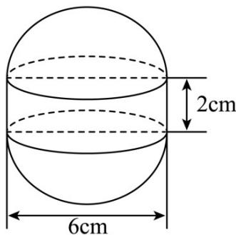

<!-- question-source:start -->
47. 如图，某种水箱用的“浮球”是由两个半球和一个圆柱筒组成，已知半球的直径是 $6\mathrm{cm}$ ，圆柱筒长 $2\mathrm{cm}$ 。

(1)这种“浮球”的体积是多少 $\mathrm{cm}^3$ ？

(2)要在 100 个这样的“浮球”表面涂一层胶质，如果每平方厘米需要涂胶 $^{20}$ 克，那么共需涂胶约多少克？
<!-- question-source:end -->

![[高中/课堂同步/题库/人教A版高中数学同步讲义(2026)/02_必修第二册/期中专项训练+期中模拟卷/专题14 简单几何体的表面积和体积（高效培优期中专项训练）数学人教A版高一必修第二册/专题14_简单几何体的表面积和体积/questions/answers/Q00077255A1.md]]
