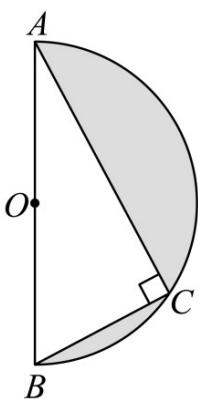

<!-- question-source:start -->
48. 如图所示，半径为 $^{1}$ 的半圆内的阴影部分当以直径 AB 所在直线为轴旋转一周时，得到一几何体，则该几何体的表面积是 \_\_\_\_ ，体积是 \_\_\_\_ ·（其中 $\angle BAC = 30^{\circ}$ ）

<!-- question-source:end -->

![[高中/课堂同步/题库/人教A版高中数学同步讲义(2026)/02_必修第二册/期中专项训练+期中模拟卷/专题14 简单几何体的表面积和体积（高效培优期中专项训练）数学人教A版高一必修第二册/专题14_简单几何体的表面积和体积/questions/answers/Q00077256A1.md]]
