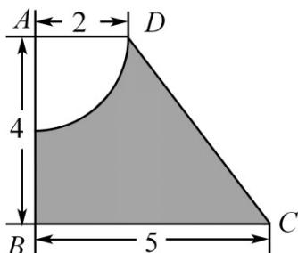

<!-- question-source:start -->
65. 如图，已知在直角梯形 $ABCD$ 中， $AD \parallel BC$ ， $AD = 2$ ， $AB = 4$ ， $BC = 5$ ，若将该图形中阴影部分绕 $AB$ 所在直线旋转一周，求形成的几何体的表面积与体积。

<!-- question-source:end -->

![[高中/课堂同步/题库/人教A版高中数学同步讲义(2026)/02_必修第二册/期中专项训练+期中模拟卷/专题14 简单几何体的表面积和体积（高效培优期中专项训练）数学人教A版高一必修第二册/专题14_简单几何体的表面积和体积/questions/answers/Q00077266A1.md]]
