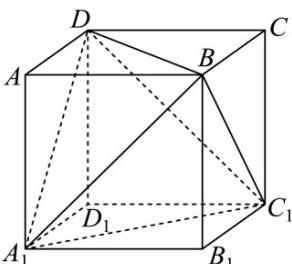

> [!faq]- 《专题14 简单几何体的表面积和体积（高效培优期中专项训练）数学人教A版高一必修第二册》官方解析
>
> > [!success]- **【答案】** A. $\sqrt{3}$ B. $\sqrt{2}$ C. $\frac{2\sqrt{3}}{3}$ D. $\frac{\sqrt{3}}{2}$
>
> > [!note]- **【解析】**
> > 正方体的棱长为 a，此时正四面体的棱长为 $\sqrt{2}a$ ，则正方体的表面积为 $6a^{2}$ ，
> >
> > 正四面体的表面积为 $4 \times \frac{1}{2} \times (\sqrt{2} a)^2 \sin \frac{\pi}{3} = 2\sqrt{3} a^2$
> >
> > 两者之比为 $\frac{6a^2}{2\sqrt{3}a^2} = \sqrt{3}$
> >
> > 故选：A.
> >
> > 
