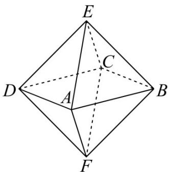
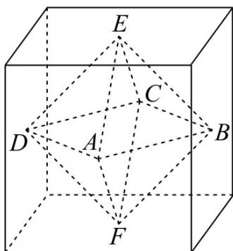
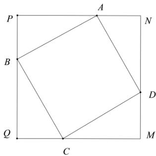
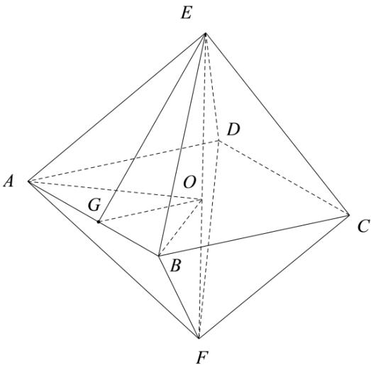

> [!faq]- 《专题14 简单几何体的表面积和体积（高效培优期中专项训练）数学人教A版高一必修第二册》官方解析
>
> > [!success]- **【答案】**  
>
> > [!note]- **【解析】**
> > 在边长为 $^{2}$ 的正方形PQMN中，设 $AP = a(0 \leq a \leq 2)$ ， $AB = x$ ，则 $PB = 2 - a$ $\therefore x^{2} = a^{2} + (2 - a)^{2} = 2(a - 1)^{2} + 2 \in [2,4]$ ，即 $AB = x \in [\sqrt{2}, 2]$
> >
> > 
> >
> > 根据题意可知： $E, F$ 为正方体底面的中心
> >
> > 取正方形 ABCD 的中心 O，则 E, O, F 三点共线，
> >
> > 取 $AB$ 的中点 $G$ ，连接 $OA, OB, OG, GE$ ，则 $EF = 2, OE = 1$ ， $OG = \frac{x}{2}, GE = \sqrt{\frac{x^2}{4} + 1}$
> >
> > 该八面体表面积 $S = 8S_{\triangle ABE} = 4x\sqrt{\frac{x^2}{4} + 1}\in [4\sqrt{3},8\sqrt{2} ]$
> >
> > 故答案为： $[4\sqrt{3},8\sqrt{2} ]$
> >
> > 
> >
> > 考点 02 棱柱、棱锥、棱台的体积
