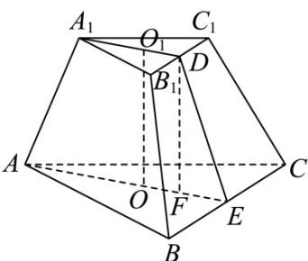
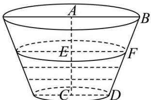

> [!faq]- 《专题14 简单几何体的表面积和体积（高效培优期中专项训练）数学人教A版高一必修第二册》官方解析
>
> > [!success]- **【答案】** $\sqrt{2}$
>
> > [!note]- **【解析】**
> > 如图：
> >
> > 
> >
> > $O,O_{1}$ 分别为正三棱台的上、下底面的中心取 $B_{1}C_{1},BC$ 的中点 D,E,连接 $A_{1}D,AE$ ,作 $DF//OO_{1}$ ,
> > 则 $A_{1}D \perp B_{1}C_{1}, AE \perp BC, DF = OO_{1}, ED \perp BC,$
> >
> > 由题意得:
> >
> > 正三棱台的上、下底面的面积分别为 $S_{\text{上}} = \frac{1}{2} \times (\sqrt{3})^2 \times \frac{\sqrt{3}}{2} = \frac{3\sqrt{3}}{4}, S_{\text{下}} = \frac{1}{2} \times (2\sqrt{3})^2 \times \frac{\sqrt{3}}{2} = 3\sqrt{3}$ ，
> >
> > 设正三棱台的高为，则 $\frac{1}{3}\left(\frac{3\sqrt{3}}{4} +\sqrt{\frac{3\sqrt{3}}{4}\times 3\sqrt{3}} +3\sqrt{3}\right)h = \frac{7\sqrt{3}}{4},$
> >
> > 解得 $h = OO_{1} = DF = 1$ $EF = \frac{1}{3}\times 2\sqrt{3}\times \frac{\sqrt{3}}{2} -\frac{1}{3}\times \sqrt{3}\times \frac{\sqrt{3}}{2} = \frac{1}{2},$ 所以该正三棱台的侧面上的高为 $ED = \sqrt{DF^2 + EF^2} = \sqrt{1^2 + \left(\frac{1}{2}\right)^2} = \frac{\sqrt{5}}{2},$ 所以在侧面等腰梯形中，侧棱 $BB_{1} = \sqrt{\left(\frac{\sqrt{3}}{2}\right)^{2} + \left(\frac{\sqrt{5}}{2}\right)^{2}} = \sqrt{2}$ 故答案为： $\sqrt{2}$
> >
> > 12. 我国古代数学名著《数书九章》中有“天池盆测雨”题：在下雨时，用一个圆台形的天池盆接雨水，天池盆盆口直径为二尺八寸，盆底直径为一尺二寸，盆深一尺八寸，若盆中积水深九寸，则平地降雨量是（注：①平地降雨量等于盆中积水体积除以盆口面积；
> > - **②**：一尺等于十寸）（）
> >
> > 【答案】
> > A. 2 寸    B. 3 寸    C. 4 寸    D. 5 寸
> >
> > 【答案】B
> >
> > 【详解】由题意可知，天池盆上底面半径为 $^{14}$ 寸，下底面半径为 $^{6}$ 寸，高为 $^{18}$ 寸．因为积水深 $^{9}$ 寸，所以水面半径为 $\frac{1}{2}(14+6)=10$ 寸，
> > 所以盆中水的体积为 $\frac{1}{3}\times\pi\times9\times(6^{2}+10^{2}+6\times10)=588\pi$ （立方寸）.
> > 所以平地降雨量等于 $\frac{588\pi}{14^{2}\pi}=3$ （寸），
> >
> > 故选：B.
> >
> > 
> >
> > 考点 03 圆柱、圆锥、圆台的表面积
> >
> > 13．圆台的一个底面圆周长是另一个底面圆周长的 $^{3}$ 倍，母线长为 $^{15}$ ，圆台的侧面积为 $420\pi$ ，则圆台较小底面圆的半径为（）
> >
> > 【答案】
> >
> > A.7 B.6 C.5 D.3
> >
> > 【答案】A
> >
> > 【详解】设圆台较小底面圆的半径为 r，较大的底面圆的半径为 R，
> >
> > 因为圆台的一个底面圆周长是另一个底面圆周长的 $^{3}$ 倍，
> >
> > 可得 $2\pi R = 3 \times 2\pi r$ ，所以 $R = 3r$
> >
> > 又因为圆台的侧面积为 $420\pi$ ，可得 $S_{\text{侧}} = \pi (r + R) \cdot l = 4\pi r \times 15 = 420\pi$ ，解得 $r = 7$
> >
> > 故选 **A**.
