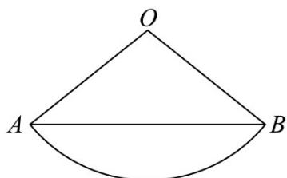

> [!faq]- 《专题14 简单几何体的表面积和体积（高效培优期中专项训练）数学人教A版高一必修第二册》官方解析
>
> > [!success]- **【答案】** A. 扇形 $AOB$ 的圆心角 $\alpha$ 为 $\frac{\pi}{3}$ B. 圆锥的高 $h$ 为 $4\sqrt{2}$ C. 圆锥的表面积为 $16\pi$ D. 从 $A$ 点绕圆锥侧面一周回到 $A$ 点的最短距离为 $6\sqrt{3}$
>
> > [!note]- **【解析】**
> > 对于 $\mathsf{A}$ 中，设圆锥的侧面展开图所得扇形的圆心角为 $\alpha$ ，可得 $\theta \times l = 2\pi r$
> >
> > 即 $6\alpha = 2\pi \times 2 = 4\pi$ ，解得 $\alpha = \frac{2\pi}{3}$ ，所以A错误；
> >
> > 对于 $\mathbf{B}$ 中，圆锥的高为 $h = \sqrt{l^2 - r^2} = 4\sqrt{2}$ ，所以 $\mathbf{B}$ 正确；
> >
> > 对于 $\mathbb{C}$ 中，由圆锥的侧面积为 $S_{1} = \pi r l = \pi \times 2\times 6 = 12\pi$ ，底面积为 $S_{2} = \pi r^{2} = 4\pi$
> >
> > 所以圆锥的表面积为 $S = S_{1} + S_{2} = 16\pi$ ，所以 C 正确；
> >
> > 对于 D 中，如图所示，圆锥的侧面展开图中，可得 $AB = \sqrt{6^{2} + 6^{2} - 2 \times 6 \times 6 \cos \frac{2\pi}{3}} = 6\sqrt{3}$ ，即从 A 点绕圆锥侧面一周回到 A 点的最短距离为 $6\sqrt{3}$ ，所以 D 正确。
> > 故选：BCD.
> >
> > 
