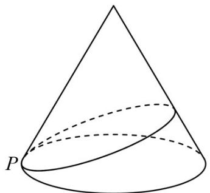
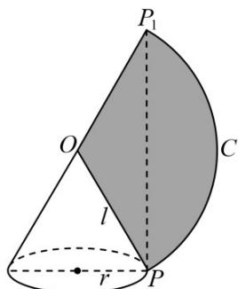
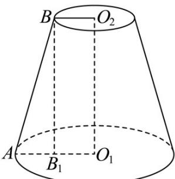

> [!faq]- 《专题14 简单几何体的表面积和体积（高效培优期中专项训练）数学人教A版高一必修第二册》官方解析
>
> > [!success]- **【答案】** 
>
> > [!note]- **【解析】**
> > 作出该圆锥的侧面展开图，如图所示：
> >
> > 
> >
> > 该小虫爬行的最短路程为 $PP_{1}$
> >
> > 由余弦定理可得 $\cos\angle P_{1}OP=\frac{OP^{2}+OP_{1}^{2}-PP_{1}^{2}}{2\cdot OP\cdot OP_{1}}=\frac{9+9-27}{2\times3\times3}=-\frac{1}{2}$ ，∴ $\angle P_{1}OP=\frac{2\pi}{3}$ ．设底面圆的半径为 r，
> > 则有 $2\pi r = \frac{2\pi}{3} \times 3$ ，解得 r = 1 ∴ 这个圆锥的高为 $h = \sqrt{9 - 1} = 2\sqrt{2}$ ，
> >
> > 这个圆锥的侧面积为 $S = \pi r l = \pi \times 1\times 3 = 3\pi$
> >
> > 故答案为： $2\sqrt{2}$ ; $3\pi$
> >
> > 18. 中国冶炼铸铁的技术起源于春秋时期，并在战国时期取得了显著的进步，推动了当时社会的发展·现将一个体积为 $\frac{14\pi}{3}\mathrm{cm}^3$ 的实心铁球熔化后，浇铸成一个圆台状的实心铁锭（不考虑损耗），若该圆台的一个底面周长是另一个底面周长的 $^2$ 倍，高为 $^2\mathrm{cm}$ ，则该圆台的表面积为（）A. $(3 + 3\sqrt{5})\pi \mathrm{cm}^2$ B. $(5 + 5\sqrt{10})\pi \mathrm{cm}^2$ C. $(5 + 3\sqrt{10})\pi \mathrm{cm}^2$ D. $(5 + 3\sqrt{5})\pi \mathrm{cm}^2$
> >
> > 【答案】D
> >
> > 【详解】如图所示，设圆台较大的底面半径为 $O_{1}A = 2r$ ，较小的底面半径为 $O_{2}B = r$ ，则 $V = \frac{1}{3}\left(\pi r^{2} + 4\pi r^{2} + 2\pi r^{2}\right) \times 2 = \frac{14\pi}{3}$ ，解得 $r = 1cm$ 。
> > 过点 B 作 $BB_{1} \perp O_{1}A$ ，垂足为 $B_{1}$ ，则母线 $l = \sqrt{AB_{1}^{2} + BB_{1}^{2}} = \sqrt{1^{2} + 2^{2}} = \sqrt{5}$ $S_{圆台}=\pi\left(r^{2}+4r^{2}+rl+2rl\right)=\left(1^{2}+4\times1^{2}+1\times\sqrt{5}+2\times1\times\sqrt{5}\right)\pi=\left(5+3\sqrt{5}\right)\pi cm^{2}.$ 故选：D.
> >
> > 
> >
> > ## 考点 04 圆柱、圆锥、圆台的体积
