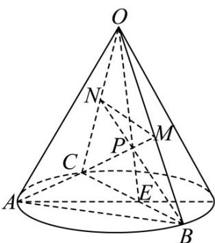

> [!faq]- 《专题14 简单几何体的表面积和体积（高效培优期中专项训练）数学人教A版高一必修第二册》官方解析
>
> > [!success]- **【答案】** (1) $\frac{\sqrt{3}}{2}$ (2) $\frac{3}{16}$ (3) $\frac{1}{4}$
>
> > [!note]- **【解析】**
> > （1）在图2中，设圆锥的底面圆半径为 $r$ ，则 $2\pi r = \frac{1}{2}\times 2\times 2\pi$ ，解得 $r = 1$
> >
> > 因为在图 $^{1}$ 中，点B、C三等分半圆，
> >
> > 所以在图 $^{2}$ 中，点 B、C 为圆锥的底面圆周的三等分点，则 VABC 为等边三角形，
> >
> > 所以 $\frac{BC}{\sin 60^\circ} = 2r = 2$ ，所以 $BC = \sqrt{3}$
> >
> > 又因为点 $M$ 、 $N$ 分别是 $OB$ 、 $OC$ 的中点，
> >
> > 所以 $MN = \frac{1}{2} BC = \frac{\sqrt{3}}{2}$ .
> >
> > (2) 因为 $S_{\triangle ABC} = \frac{1}{2} \times \sqrt{3} \times \sqrt{3} \times \frac{\sqrt{3}}{2} = \frac{3\sqrt{3}}{4}$ ，圆锥的高 $h = \sqrt{2^{2} - 1^{2}} = \sqrt{3}$ ，
> >
> > 所以 $V_{O-ABC} = \frac{1}{3} \times S_{\triangle ABC} \times h = \frac{1}{3} \times \frac{3\sqrt{3}}{4} \times \sqrt{3} = \frac{3}{4}$
> >
> > 所以 $V_{M-ACN}=\frac{1}{2}V_{M-ACO}=\frac{1}{2}\times\frac{1}{2}V_{B-ACO}=\frac{1}{4}V_{O-ABC}=\frac{3}{16}$
> >
> > 即四面体 ACMN 的体积为 $\frac{3}{16}$ .
> >
> > (3) 连接 BN, CM 交于点 P，连接 OP 并延长 OP 交 BC 于点 E，
> >
> > 
> >
> > 则三棱锥 M-ABC 与三棱锥 N-ABC 公共部分即为三棱锥 P-ABC.
> >
> > 因为点 M 、 N 分别是 OB 、 OC 的中点，
> >
> > 所以 $E$ 为 $BC$ 的中点，且 $PE = \frac{1}{3} OE$
> >
> > 所以 $V_{P - ABC} = \frac{1}{3} V_{O - ABC} = \frac{1}{4}$
> >
> > 所以三棱锥 M-ABC 与三棱锥 N-ABC 公共部分的体积为 $\frac{1}{4}$ .
