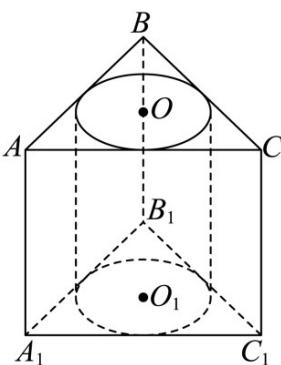
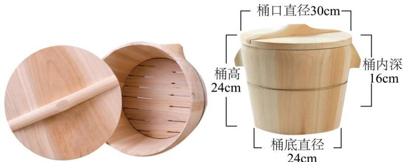

> [!faq]- 《专题14 简单几何体的表面积和体积（高效培优期中专项训练）数学人教A版高一必修第二册》官方解析
>
> > [!success]- **【答案】**  A. VABC 内切圆的半径为 $\sqrt{2}$ B. 被挖掉的圆柱的侧面积为 $12\sqrt{3}\pi$ C. 该几何体的表面积为 $18\sqrt{3} + 54 + (12\sqrt{3} - 6)\pi$ D. 该几何体的体积为 $54\sqrt{3} - 18\pi$
>
> > [!note]- **【解析】**
> > 对于 $A$ ，已知正三棱柱 $ABC - A_{1}B_{1}C_{1}$ 的侧面 $AA_{1}C_{1}C$ 为边长为6的正方形，则正三棱柱底面正三角形 $ABC$ 的边长 $a = 6$ .
> >
> > 设正三角形内切圆半径为 $r$ ，根据正三角形内切圆半径公式 $r = \frac{\sqrt{3}}{6} a$
> >
> > 把 $a = 6$ 代入 $r = \frac{\sqrt{3}}{6} a$ ，得 $r = \frac{\sqrt{3}}{6}\times 6 = \sqrt{3}$ ，所以A选项错误
> >
> > $$
> > \mathrm{B}
> > $$
> >
> > $$
> > \mathsf {A}
> > $$
> >
> > $$
> > r = \sqrt {3}
> > $$
> >
> > $$
> > S _ {\mathrm{侧}} = 2 \pi r h
> > $$
> >
> > 把 $r = \sqrt{3}$ ， $h = 6$ 代入公式，得 $S_{\text{侧}} = 2\pi \times \sqrt{3} \times 6 = 12\sqrt{3}\pi$ ，所以B选项正确
> >
> > 对于 $C$ ，先求正三棱柱两个底面正三角形的面积 $S_{\text{底}} = 2 \times \frac{\sqrt{3}}{4} a^2$ ，把 $a = 6$ 代入得 $S_{\text{底}} = 2 \times \frac{\sqrt{3}}{4} \times 6^2 = 18\sqrt{3}$
> >
> > 正三棱柱三个侧面的面积 $S_{\text{侧面}} = 3 \times 6 \times 6 = 108$ ，两个内切圆的面积 $S_{\text{切}} = 2 \times \pi r^2 = 2 \times \pi \times (\sqrt{3})^2 = 6\pi$ ，圆柱侧面积 $S_{\text{侧}} = 12\sqrt{3}\pi$ （已在 B 中求出）·
> >
> > 则该几何体的表面积 $S = 18\sqrt{3} + 108 - 6\pi + 12\sqrt{3}\pi = 18\sqrt{3} + 108 + (12\sqrt{3} - 6)\pi$ ，所以 C 选项错误。对于 D，正三棱柱的体积 $V_{\text {三棱柱}} = \frac{\sqrt{3}}{4} a^2 h$ ，把 $a = 6$ ， $h = 6$ 代入得 $V_{\text {三棱柱}} = \frac{\sqrt{3}}{4} \times 6^2 \times 6 = 54\sqrt{3}$ 。
> >
> > 圆柱的体积 $V_{圆柱} = \pi r^{2} h$ ，把 $r = \sqrt{3}$ ，h = 6 代入得 $V_{圆柱} = \pi \times (\sqrt{3})^{2} \times 6 = 18\pi$ .
> >
> > 该几何体的体积 $V = V_{三棱柱} - V_{圆柱} = 54\sqrt{3} - 18\pi$ ，所以 D 选项正确.
> >
> > 故选：BD.
> >
> > 22. 宁化农村做饭常用一种叫饭甑的容器，随着时代的变化，饭甑也走向小型化，制作材料也有部分变化。如图所示，这种饭甑都是用杉木制作的，木桶可以看作无底的圆台，内部放一个圆形木隔板，盖子也是圆形的木板。其尺寸如下：桶口直径为 $30\mathrm{cm}$ ，桶底直径为 $24\mathrm{cm}$ ，桶高为 $24\mathrm{cm}$ ，桶内深为 $16\mathrm{cm}$ 。
> >
> > 
> >
> > (1)求该饭甑木桶（不含隔板和盖子）的面积；（不计木板的厚度）
> >
> > (2)若该饭甑装满（盖子刚好与米饭齐平）米饭，求米饭的体积；
> >
> > (3)若要做一个球形容器，把该饭甑放入容器内，问：当该容器半径最小时，球心到饭甑底部的距离？（不计容器的厚度）
> >
> > 【答案】(1) $81\sqrt{65}\pi cm^{2}$
> >
> > (2) $\frac{9424}{3}\pi cm^{3}$
> >
> > (3) $\frac{219}{16}$ cm
> >
> > 【详解】（1）由已知得两底面半径分别为 $r_1 = 12$ ， $r_2 = 15$ $\because$ 木桶高为 $h = 24$ $\therefore$ 母线长为 $l = \sqrt{24^2 + (15 - 12)^2} = 3\sqrt{65}$ $\therefore$ 该饭甑木桶的面积为 $S = \pi (12 + 15)\times 3\sqrt{65} = 81\sqrt{65}\pi$ $\mathrm{cm}^2$
> >
> > (2) 由已知得 中间隔板的半径为 $r = \frac{24 - 16}{24}(15 - 12) + 12 = 13$
> >
> > ∴米饭的体积为 $V=\frac{1}{3}\pi\left(13^{2}+13\times15+15^{2}\right)\times16=\frac{9424}{3}\pi$ cm $^{3}$
> >
> > (3) 设球心到饭甑底部的距离为 $d$ ，球形容器的半径为 $R$
> >
> > 则 $\left\{ \begin{array}{l} R^2 = 12^2 + d^2 \\ R^2 = 15^2 + (24 - d)^2 \end{array} \right.$
> >
> > $\therefore 144 + d^{2} = 225 + (24 - d)^{2}, d = \frac{657}{48} = \frac{219}{16}$
> >
> > :球心到饭甑底部的距离为 $\frac{219}{16}$ cm
