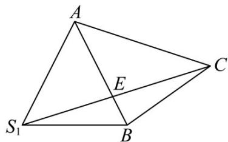

> [!faq]- 《专题14 简单几何体的表面积和体积（高效培优期中专项训练）数学人教A版高一必修第二册》官方解析
>
> > [!success]- **【答案】** ABD
>
> > [!note]- **【解析】**
> > 由题意，易得 $l=3\sqrt{2}$ ，r=OC=3。
> >
> > 对于 A：圆锥 SO 的侧面积为 $\pi rl = \pi \times 3 \times 3\sqrt{2} = 9\sqrt{2}\pi$ ，故 A 正确；
> >
> > 对于 B：由图知，当 $OB \perp AC$ 时，VABC 的面积最大，此时 $S_{\triangle ABC} = \frac{1}{2} \times 6 \times 3 = 9$
> >
> > 则三棱锥 $S - ABC$ 体积的最大值为： $V = \frac{1}{3} \times S_{\triangle ABC} \times SO = \frac{1}{3} \times 9 \times 3 = 9$ ，故 B 正确；
> >
> > 对于 C：当点 B 与点 A 重合时， $\angle ASB = \theta$ 为最小角；
> >
> > 当点 B 与点 C 重合时， $\angle ASB = \frac{\pi}{2}$ ，达到最大值，又因为点 B 与 A，C 不重合，
> > 则 $\angle ASB\in(0,\frac{\pi}{2})$ .
> >
> > 又 $2\angle SAB + \angle ASB = \pi$ ，可得 $\angle SAB\in (\frac{\pi}{4},\frac{\pi}{2})$ ，故C错误；
> >
> > 对于 D：因为 AB = BC， $\angle ABC = 90^{\circ}$ ，AC = 6，所以 $AB = BC = 3\sqrt{2}$ 。
> >
> > 又 $SA = SB = 3\sqrt{2}$ ，所以 $\triangle SAB$ 为等边三角形，∴ $\angle SBA = 60^{\circ}$
> >
> > 将 $\triangle SAB$ 以 $AB$ 为轴旋转到与VABC共面，
> >
> > 得到 $\triangle S_{1}AB$ ，则 $\triangle S_{1}AB$ 为等边三角形， $\angle S_{1}BA = 60^{\circ}$ .
> >
> > 如图： $(SE+CE)_{\min}=S_{1}C$
> >
> > 
> >
> > 因为 $S_{1}B = BC = 3\sqrt{2}$ ， $\angle S_{1}BC = \angle S_{1}BA + \angle ABC = 150^{\circ}$
> >
> > 由余弦定理， $S_{1}C^{2} = S_{1}B^{2} + BC^{2} - 2\times S_{1}B\times BC\times \cos 150^{\circ} = 18 + 18 + 18\sqrt{3} = 36 + 18\sqrt{3}$
> >
> > 则 $S_{1}C = \sqrt{36 + 18\sqrt{3}} = 3\sqrt{4 + 2\sqrt{3}} = 3\sqrt{(\sqrt{3} + 1)^{2}} = 3(\sqrt{3} + 1)$ ，故D正确·
> >
> > 故选 **ABD**.
