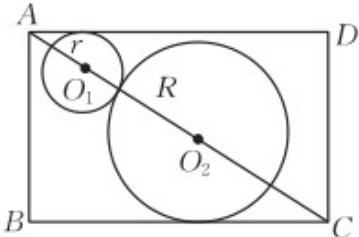

> [!faq]- 《专题14 简单几何体的表面积和体积（高效培优期中专项训练）数学人教A版高一必修第二册》官方解析
>
> > [!success]- **【答案】** (1) $\frac{3(\sqrt{3} - 1)}{2}$ (2) $R = r = \frac{3(\sqrt{3} - 1)}{4}$ , $9(2 - \sqrt{3})\pi$
>
> > [!note]- **【解析】**
> > （1）由题知ABCD为过球心 $O_{1}, O_{2}$ 和对棱AB，CD的截面，如图，
> >
> > 
> >
> > 则 $AC = \sqrt{(\sqrt{3})^2 + (\sqrt{3})^2 + (\sqrt{3})^2} = 3$
> >
> > 设球 $O_{1}, O_{2}$ 的半径分别为 r, R,
> >
> > 则 $AC = AO_{1} + O_{1}O_{2} + O_{2}C = \sqrt{3} r + (r + R) + \sqrt{3} R$
> >
> > 由 $(\sqrt{3} + 1)(r + R) = 3$ ，解得 $r + R = \frac{3}{\sqrt{3} + 1} = \frac{3(\sqrt{3} - 1)}{2}$
> >
> > (2) 设这两个球的表面积之和为 $S$ ，则 $S = 4\pi \left(r^{2} + R^{2}\right)$
> >
> > 所以 $S = 4\pi \left[(r + R)^2 - 2rR\right]$
> >
> > 又因为 $rR \leq \frac{(r + R)^2}{4}$ ，当且仅当 $r = R$ 时，等号成立，
> >
> > 所以 $-2rR - \frac{(r + R)^{2}}{2}$ ，
> >
> > 所以 $S = 4\pi \left[\left(r + R\right)^2 - 2rR\right] \quad 2\pi (r + R)^2 = 2\pi \cdot \frac{9(4 - 2\sqrt{3})}{4} = 9(2 - \sqrt{3})\pi$
> >
> > 当且仅当 $r = R = \frac{3(\sqrt{3} - 1)}{4}$ 时，等号成立.
> >
> > 27. 三棱锥 $P - ABC$ 的顶点都在球 $O$ 的球面上，且 $AB = 2\sqrt{3}, AC = \sqrt{3}, \angle ABC = \frac{\pi}{6}$ ，若三棱锥 $P - ABC$ 的体积最大值为 $\frac{3\sqrt{3}}{2}$ ，则球 $O$ 的表面积为 \_\_\_\_。
> >
> > 【答案】 $16\pi$
> >
> > 【详解】由余弦定理可知： $AC^{2}=AB^{2}+BC^{2}-2AB\times BC\cos\frac{p}{6}$
> >
> > 即 $3 = 12 + BC^{2} - 6BC$ ，又 BC > 0，解得 BC = 3。
> >
> > 因为 $BC^{2} + AC^{2} = AB^{2}$ ，故 $\angle C = \frac{\pi}{2}$ ，VABC 所在小圆的圆心为 AB 中点，小圆半径 $r = \sqrt{3}$ ；
> >
> > 记球心到小圆圆心的距离为 $d$ ，球半径为 $R$ ，三棱锥 $P - ABC$ 的高为 $h$
> >
> > 则有 $R^2 = d^2 + r^2 = 3 + d^2$
> >
> > 当三棱锥 P-ABC 的体积最大时，P 与 VABC 在球心两侧，此时有 $d + R = h_{max}$ ，
> >
> > 再由 $\left(V_{P-ABC}\right)_{\max}=\frac{1}{3}S_{\triangle ABC}h_{\max}$ ，可知 $h_{\max}=3$ ，
> >
> > 故 $R^2 = 3 + (3 - R)^2$ ，解得 $R = 2$ ，此时 $S_{\text{表}} = 4pR^2 = 4p'4 = 16p$
> >
> > 故答案为： $16\pi$ ：
