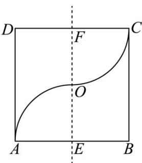

> [!faq]- 《专题14 简单几何体的表面积和体积（高效培优期中专项训练）数学人教A版高一必修第二册》官方解析
>
> > [!success]- **【答案】** 
>
> > [!note]- **【解析】**
> > 由图象知，以直线 EF 为轴旋转，弧 AO, CO 和线段 AE, CF 旋转一周形成的面所围成的几何体是两个半径均为 $^{10}$ 的半球，可合为一个完整的球，
> > 故几何体的表面积为一个球的表面积加两个圆的面积，
> > 即 $S = 4\pi R^{2} + 2\pi R^{2} = 6\pi R^{2} = 6\pi \times 10^{2} = 600\pi$ 故答案为： $600\pi$
