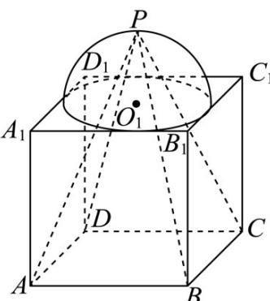
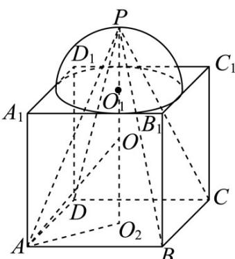
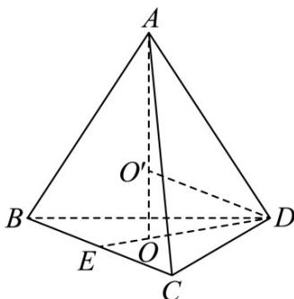

> [!faq]- 《专题14 简单几何体的表面积和体积（高效培优期中专项训练）数学人教A版高一必修第二册》官方解析
>
> > [!success]- **【答案】**  A. $(44 + 8\sqrt{10})\pi$ B. $(44 - 8\sqrt{10})\pi$ C. $(52 + 8\sqrt{22})\pi$ D. $(52 - 8\sqrt{22})\pi$
>
> > [!note]- **【解析】**
> > 令球 O 的半径为 R，由球 O 的体积为 $\frac{1331}{6}\pi$ ，得 $\frac{4}{3}\pi R^{3} = \frac{1331}{6}\pi$ ，解得 $R = \frac{11}{2}$ ，记 ABCD 对角线交点为 $O_{2}$ ，由对称性得 $P, O_{1}, O, O_{2}$ 位于一条直线上，设正方体棱长为 a，在 $\triangle AO_{2}P$ 中， $OO_{1} = PO - PO_{1} = \frac{11}{2} - \frac{a}{2}$ ， $OO_{2} = O_{1}O_{2} - O_{1}O = a - (\frac{11}{2} - \frac{a}{2}) = \frac{3a}{2} - \frac{11}{2}$ ，在 Rt $\triangle AO_{2}O$ 中， $AO_{2}^{2} + OO_{2}^{2} = AO^{2}$ ，则 $(\frac{\sqrt{2}}{2}a)^{2} + (\frac{3a}{2} - \frac{11}{2})^{2} = (\frac{11}{2})^{2}$ ，解得 a = 6，在 Rt $\triangle AO_{2}P$ 中， $AP^{2} = AO_{2}^{2} + PO_{2}^{2} = (3\sqrt{2})^{2} + 9^{2} = 99$ ，解得 $AP = 3\sqrt{11}$ ，四棱锥 P - ABCD 是一个底面边长为 6，高为 9，侧棱长为 $3\sqrt{11}$ 的正四棱锥，斜高 $3\sqrt{10}$ ，四棱锥 P - ABCD 的表面积 $S = 4 \cdot \frac{1}{2} \cdot 6 \cdot 3\sqrt{10} + 6^{2} = 36(\sqrt{10} + 1)$ ，设四棱锥 P - ABCD 的内切球半径为 r，则 $V = \frac{1}{3} Sr = \frac{1}{3} S_{ABCD} \cdot PO_{2}$ ，即 $36(\sqrt{10} + 1)r = 6^{2} \cdot 9$ ，解得 $r = \sqrt{10} - 1$ ，则 $4\pi r^{2} = 4\pi (\sqrt{10} - 1)^{2} = (44 - 8\sqrt{10})\pi$ ，所以四棱锥 P - ABCD 的内切球的表面积为 $(44 - 8\sqrt{10})\pi$ 。
> >
> > 故选：B
> >
> > 
> >
> > 33．三棱锥 A-BCD 的侧棱长为 $2\sqrt{5}$ ，底面是边长为 $2\sqrt{3}$ 的等边三角形，则该三棱锥外接球的体积为 \_\_\_\_.
> > 【答案】 $\frac{125}{6}\pi$
> >
> > 【详解】
> >
> > 
> >
> > 该三棱锥正三棱锥，O 为底面 BCD 的中心，
> >
> > $AO \perp$ 底面 BCD ，球心 $O'$ 在直线 AO 上，
> >
> > 底面是边长为 $2\sqrt{3}$ 的等边三角形， $O$ 为底面 $BCD$ 的中心，
> >
> > $$
> > D E = C D \sin 6 0 ^ {\circ} = 2 \sqrt {3} \times \frac {\sqrt {3}}{2} = 3, O D = \frac {2}{3} D E = \frac {2}{3} \times 3 = 2
> > $$
> >
> > $AO = \sqrt{AD^{2} - OD^{2}} = \sqrt{20 - 4} = 4$
> >
> > 设外接球半径为 R，在 $\Delta OO^{\prime}D$ 中，
> >
> > $$
> > \left(A O - R\right) ^ {2} = R ^ {2} - O D ^ {2}, R = \frac {A O ^ {2} + O D ^ {2}}{2 A O} = \frac {1 6 + 4}{8} = \frac {5}{2},
> > $$
> >
> > 所以体积 $V = \frac{4}{3} \pi R^{3} = \frac{125}{6} \pi$ ，
> >
> > 故答案为： $\frac{125}{6}\pi$
